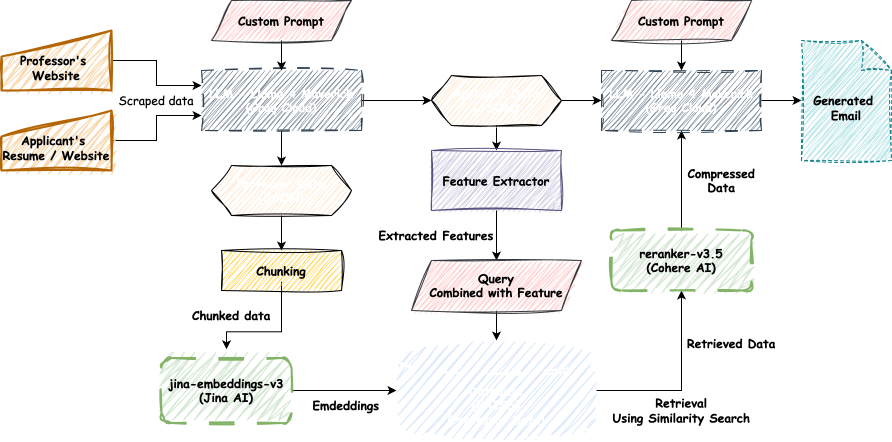

<div align="center">

# RAG Powered Cold Mail Generator

<br>

<p align="center">
   <a href="https://www.python.org/">
      
   </a>

   <a href="https://www.langchain.com/">
      
   </a>

   <a href="https://faiss.ai/">
      
   </a>

   <a href="https://www.crummy.com/software/BeautifulSoup/">
      
   </a>

   <br>

   <a href="https://console.groq.com/docs/model/meta-llama/llama-4-maverick-17b-128e-instruct">
  
   </a>

   <a href="https://jina.ai/news/jina-embeddings-v3-a-frontier-multilingual-embedding-model/">
  
   </a>


   <a href="https://cohere.com/blog/rerank-3pt5">
   
   </a>
</p>

This is a Retrieval-Augmented Generation (RAG) project that automates the creation of personalized cold emails for prospective Master's or PhD students reaching out to professors. It leverages vector search and large language models to craft highly tailored emails based on both the applicant’s and professor’s information.

</div>

---

### 🧠 Workflow 



---

### ✨ Features

1. **Generates emails based on:**
   - Applicant's profile and academic background
   - Professor's research interests and works
   - Papers read (or smart matching if no papers are read)
2. **Smart fallback:**  
   If no papers have been read, the system automatically matches professor's papers to the applicant's research experience.
3. **Human-like personalization:**  
   Emails are crafted to feel genuine, motivated, and thoughtful.
4. **Auto-save:**  
   Generated emails are saved neatly with timestamps for easy later editing.

> **‼️ Note:**  
> Please review and edit the email slightly before sending. While the LLM does a good job, small personal tweaks make it even better.

---

### ⏳ TODO

- [x] Run the project locally
- [x] Add a working mechanism with a workflow diagram
- [x] Integrate Streamlit app support
- [ ] Extend to full-stack application support

---

### 🧰 Tech Stack 

- **Core Programming Language:** Python 
- **LLM Framework:** LangChain
- **Vector Database:** FAISS
- **Web Scraping:** BeautifulSoup4
- **Chat Model:** llama-4-maverick-17b-128e-instruct (Groq Cloud)
- **Embedding Model:** jina-embeddings-v3 (Jina AI)
- **Reranking Model:** rerank-v3.5 (Cohere AI)

---

### 🗂️ Project Structure

```
cold-mail-generator/
├── composer/
│   ├── draft_mail.py       # Generates and formats the email draft
│   └── prompts.py          # Contains prompt templates for the LLM
│
├── configs/
│   └── model_config.py     # Configuration settings for the models (language, embedding, reranking)
│
├── env/                    # Virtual environment directory
│
├── outputs/                # Stores generated emails with timestamps
│
├── processing/
│   ├── data_cleaning.py    # Cleans and preprocesses scraped data and features
│   ├── database.py         # Handles data storage and embeddings
│   └── retrieval.py        # Extracts relevant information from database
│
├── scraping/
│   ├── scrape_prof.py      # Scrapes professor's information
│   └── scrape_user.py      # Processes applicant's information
│
├── .env                    # Environment variables (e.g., API keys)
├── .gitignore              # Specifies files and folders to ignore in Git
├── README.md               # Project documentation
├── main.py                 # Main script to run the application
└── requirements.txt        # Dependencies
```

---

### 🚀 Getting Started

#### Prerequisites

- Python 3.9 
- Git installed on your system

#### 🛠️ Installation

1. **Clone the repository**

   ```bash
   git clone https://github.com/arpon-kapuria/cold-mail-generator.git
   cd cold-email-generator
   ```

2. **Create and activate a virtual environment**

   ```bash
   python3.9 -m venv env
   source env/bin/activate   # On Windows: env\Scripts\activate
   ```

3. **Install project dependencies**

   ```bash
   pip3.9 install -r requirements.txt
   
   # If the above doesn't work, try:
   pip install -r requirements.txt 
   ```
   

4. **Set up environment variables**

   Create a `.env` file in the root directory and add necessary environment variables:

   ```
   GROQ_API_KEY="groq_api_key"
   JINA_API_TOKEN="jina_api_token"
   COHERE_API_KEY="cohere_api_key"
   ```

---

### 📝 How to Use

1. **Launch the Streamlit app**

   ```bash
   streamlit run main.py
   ```
  
2. **Result**

   - Your generated cold email will be printed on the screen AND saved automatically as a .txt file with the current date and time inside the `outputs/` folder.
   - The email file will be named like:  
     ```
     Email_YYYY-MM-DD_HH-MM-SS.txt
     ```

---

### ⚙️ Customization

- **Prompt Template**  
  Customize the tone, structure, and content of the generated emails by editing [`composer/prompts.py`](composer/prompts.py).

- **Model Settings**  
  Adjust LLM parameters such as model name, temperature, and others in [`configs/model_config.py`](configs/model_config.py).

- **Data Cleaning & Retrieval**  
  Improve or modify the data processing logic inside the [`processing/`](processing/) directory.

- **Reranking**  
  Reranker support is available in [`processing/retrieval.py`](processing/retrieval.py) to retrieve more relevant information.  
  *(Note: Reranking is currently optional and not enabled by default.)*

---

### 📋 Notes

- `.env` must be configured properly with the required keys.
- Internet connection is required for scraping professor data and calling the language model API.
- Use responsibly and ethically while contacting professors.

---

### 🤝 Contributing

Contributions are always welcome. Potential areas to work on -

- **Data Formatting & Chunking:**  
  Enhance how data is preprocessed before storing it into the database for better retrieval efficiency.

- **Improved Retrieval:**  
  Implement smarter techniques to fetch more relevant and similar information from the vector database.

- **Advanced Reranking:**  
  Integrate reranker models more effectively to prioritize the most contextually relevant results.

- **Prompt Engineering:**  
  Design even better prompts to guide the LLM into generating more precise, context-aware, and impactful emails.

---

### License

This project is licensed under the [MIT License](https://opensource.org/licenses/MIT).
